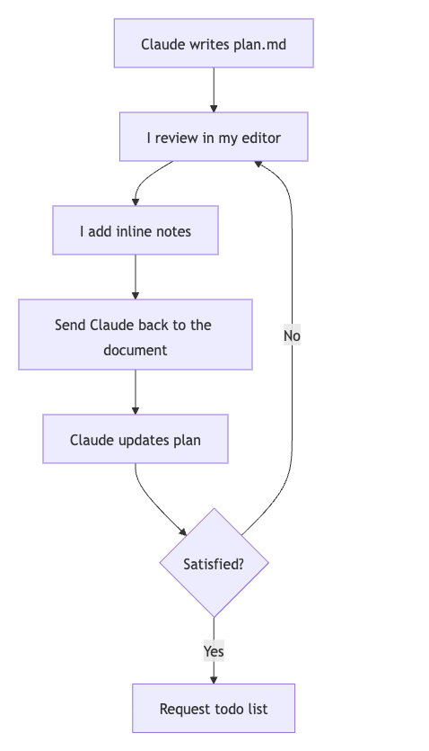

# Phase 3: The Annotation Cycle & Todo List

## Objective
To inject your product judgment, domain knowledge, and engineering constraints into the plan. This is where the actual "creative work" and problem-solving happen.

## Agent Instructions
The agent must read the user's inline notes directly written into the `plan.md` file, update the document accordingly, and **strictly halt** without writing the implementation code. Finally, it must break the plan down into a granular checklist.

## Key Tricks & Best Practices
- **Shared Mutable State:** Open the `plan.md` in your editor and write inline notes directly in the text (e.g., correcting assumptions, rejecting approaches, or adding constraints).
- **The Guardrail Phrase:** Always append **"don't implement yet"** to your prompts. Without this, the AI will jump to writing code prematurely. Repeat this cycle 1 to 6 times until the plan is perfect.
- **The Todo List:** Request a granular task breakdown inside the plan so the AI can mark items as completed during the actual implementation phase.
- **Sizing:** If the requirement is larger than what would be a simple task for a human, ask the AI to break it down into sub-tasks.

## Prompt Examples
- **Inline Annotation Examples:** *"use drizzle:generate for migrations, not raw SQL"*, *"no — this should be a PATCH, not a PUT"*, *"remove this section entirely, we don't need caching here"*.
- **The Cycle Prompt:** *"I added a few notes to the document, address all the notes and update the document accordingly. don't implement yet"*
- **The Checklist Prompt:** *"add a detailed todo list to the plan, with all the phases and individual tasks necessary to complete the plan - don't implement yet"*
