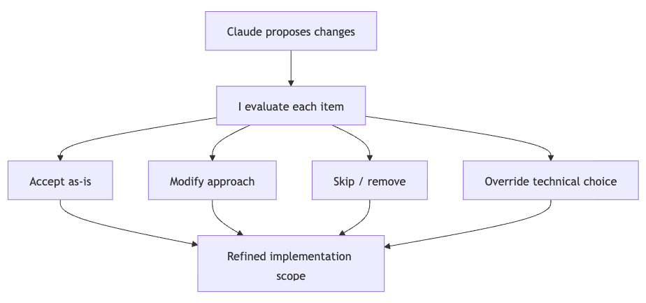

# Phase 5: Feedback & Supervision

## Objective
To steer the AI during execution with minimal effort, handle unexpected edge cases, and maintain control over technical choices (cherry-picking or trimming scope).

## Agent Instructions
The agent must process terse, direct feedback from the user, fix UI/logic bugs using reference points, and adjust the scope if the user reverts a commit.
While requiring fixes and changes to the agent, start by requiring the agent to update the plan with the instructions or tasks related to the new prompt.
The `plan.md` becomes the source of truth, instead of the code.

## Key Tricks & Best Practices
- **Terse Corrections:** Because all context is in the same long session, keep feedback extremely brief (e.g., "wider", "still cropped").
- **Reference Existing Patterns:** Instead of describing a UI or logic from scratch, point to an existing file in the codebase.
- **Revert and Re-scope:** If the AI goes down a rabbit hole, don't try to incrementally patch it. Revert the Git changes completely and give a narrowed instruction.
- **Single Long Sessions:** Keep Research, Planning, and Implementation in one single chat session. The AI builds up deep context, and auto-compaction handles the limits while the `.md` artifact remains your anchor.

## Prompt Examples
- **Terse Feedback:** *"You didn't implement the deduplicateByTitle function."*
- **Referencing:** *"this table should look exactly like the users table, same header, same pagination, same row density."*
- **Reverting:** *"I reverted everything. Now all I want is to make the list view more minimal — nothing else."*
- **Cherry-picking:** *"for the first one, just use Promise.all... ignore the fourth and fifth ones, they're not worth the complexity."*
